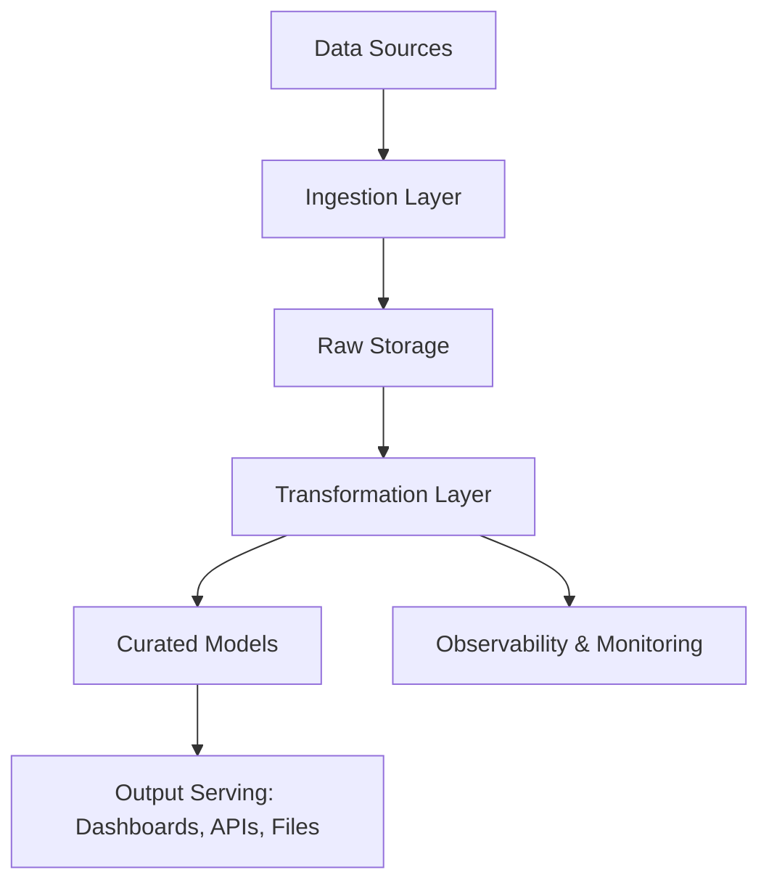

# 🏗 System Overview

This document provides a high-level architectural overview of the data platform — including major components, data flow, and responsibilities across layers.

---

## 📌 Purpose

To provide a shared understanding of how data flows through the system — from ingestion to serving — and how different architectural pieces connect and operate.

---

## 🧩 Core Components

| Layer             | Description                                                       |
|------------------|-------------------------------------------------------------------|
| Ingestion         | Collects data from external/internal sources                     |
| Storage           | Persists raw and processed data (e.g., object storage, warehouse)|
| Transformation    | Cleans, enriches, and models the data                            |
| Serving           | Makes transformed data accessible to users and systems           |
| Orchestration     | Coordinates and schedules data workflows                         |
| Observability     | Tracks quality, performance, and reliability                     |
| Access Control    | Manages permissions, roles, and data governance                  |

---

## 🔄 End-to-End Data Flow

---

## 📥 Data Sources

- Internal applications (e.g., user events, logs)
- 3rd-party tools (e.g., marketing platforms, CRMs)
- External datasets or partner feeds

---

## 📤 Output Destinations

- BI tools (e.g., dashboards)
- Machine learning pipelines
- External APIs or partner exports

---

## 🛠 Orchestration & Automation

- Jobs triggered via DAGs or event-based systems
- Retry logic, dependency chaining, and run history tracking

---

## 🧪 Quality & Monitoring

- Freshness checks
- Data contract validation
- Metric drift detection
- Dashboards and alerts for failures or anomalies

---

## 🔐 Security & Access

- Access control on raw and transformed layers
- PII handling and masking where necessary
- Role-based access to outputs

---

## 🚀 Future Considerations

- Scalability (e.g., growing data volume or complexity)
- Modularization and platform abstraction
- Cost optimization strategies

---

*This system evolves as we add new data products, pipelines, or tooling — keep this updated to reflect reality.*
