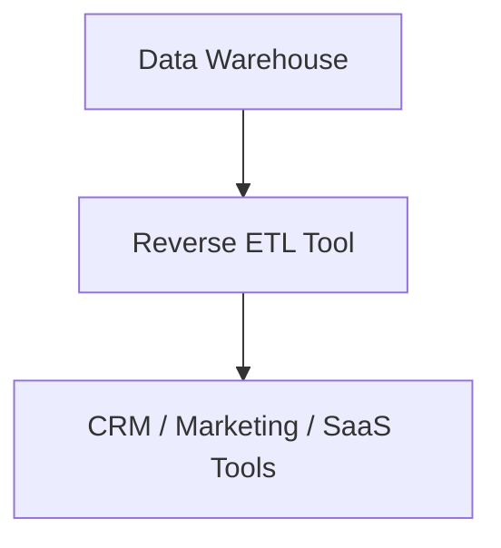

# 🔁 Reverse ETL

**Reverse ETL** is the process of moving data from a data warehouse back into operational systems like CRMs, marketing tools, or SaaS platforms to make analytics actionable.

---

## 🧠 What is Reverse ETL?

While traditional ETL (Extract, Transform, Load) pipelines move data **into** the warehouse, **Reverse ETL** sends transformed data **out** of the warehouse and back into tools where business teams operate.

---

## 🎯 Why Use Reverse ETL?

- **Personalized marketing** using enriched customer attributes
- **Sales enablement** via updated lead scoring in CRMs
- **Operations automation** through syncing calculated fields
- **Product analytics** to power in-app experiences

---

## 🛠️ Architecture Overview

---

## 🚀 Common Tools

| Tool        | Notes                          |
|-------------|--------------------------------|
| Census      | SQL-first, dbt native          |
| Hightouch   | UI-friendly, wide integrations |
| Rudderstack | Also supports event streaming  |
| Grouparoo   | Open-source reverse ETL        |

---

## 🧩 Key Features to Look For

- **SQL or dbt native modeling**
- **Change data capture (CDC) support**
- **Monitoring & alerting**
- **Idempotency** (no duplicate updates)
- **Fine-grained sync scheduling**

---

## ✅ Best Practices

- Treat reverse ETL like production code
- Monitor sync failures and stale data
- Use warehouse views/models as source of truth
- Include logging of outbound syncs for auditing

---

## 🔄 Reverse ETL vs Operational Analytics

| Category        | ETL                | Reverse ETL        |
|-----------------|--------------------|---------------------|
| Direction       | Into warehouse     | Out of warehouse    |
| Use Case        | Reporting, BI      | Activation, Ops     |
| Consumers       | Analysts, Data team| Marketing, Sales    |

---

## 📚 References

- [What is Reverse ETL? – Hightouch](https://hightouch.com/blog/reverse-etl)
- [Reverse ETL in dbt – Census](https://www.getcensus.com/blog/dbt-and-reverse-etl)
- [Modern Data Stack – Fivetran](https://www.fivetran.com/blog/the-modern-data-stack)

---

🔄 Reverse ETL bridges the gap between insights and action!
